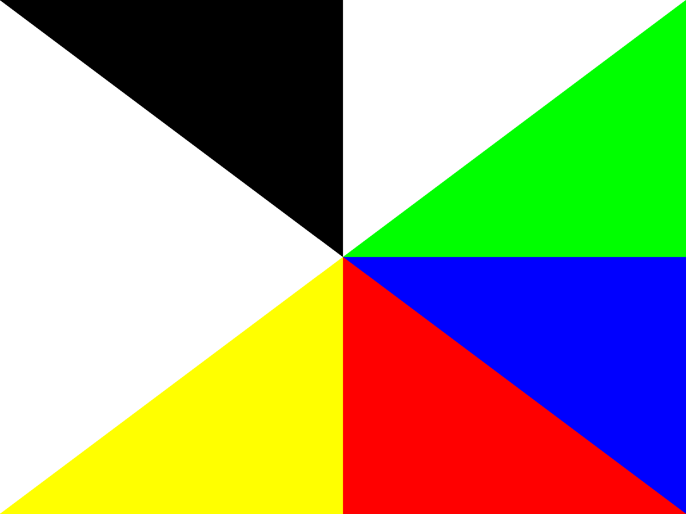

<!DOCTYPE html>
<html>
<body style="background-color: #ccccff;">
<!-- var -->

[English] <a href="#lang_ja">[日本語]</a>

<h1 align="center">Large Photo Frame with 13.3 inch 6 Color E-Paper</h1>
<h2>Introduction</h2>

After making a <a href="https&#58;//github.com/middle-river/color_epd_photo2">photo frame using a 7.3 inch 7 color e-paper display</a>, I newly got a new 13.3 inch 6 color e-paper, so I compared the image quality with the previous e-paper and created another photo frame.

<h2>Comparison of Color E-Papers (ACeP vs. Spectra 6)</h2>

This new e-paper uses a new technology called Spectra 6 (E6). Compared to the previous ACeP technology, Spectra 6 has only six colors compared with seven colors of ACeP, but is said to be able to display more saturated colors. I couldn't find much evaluation results about the image quality of this e-paper, therefore compared the image quality with that of the previous color e-paper.

<h3>Measuring Colors Precisely</h3>

Pictures taken with digital cameras are affected by various factors like lighting and and image processing in the cameras. Therefore, I will apply color correction using a color chart (color checker). There are commercial software programs for color correction but I used here the ColorCorrectionModel library in OpenCV. Color correction is performed by affine transforming the RGB color channels. It can also automatically detect a color chart in an image. This OpenCV library is highly customizable, so any color chart can be used as long as the exact colors are known (in the Lab color space). Here, I used a 24-color chart from Charttu. There seem to be several other color charts, in addition to major color checkers from X-Rite and Datacolor, such as the Pantone Color Matching Card and DGK Color Calibration Chart.

For color correction, it is best to use images obtained from image sensors of digital cameras directly. Color correction may not be accurate for images which undergone nonlinear processing such as white balance adjustment and noise reduction. In this evaluation, I used RAW images taken with a mirrorless camera, and converted them as Linear 16 bit images using the dcraw program. The code used for color correction can be found <a href="https&#58;//github.com/middle-river/color_epd_photo3/tree/main/color_correction">here</a>. All of the photos on this page that show a color chart were taken under natural light and color-corrected.

<h3>Comparison with Color Patterns</h3>

First, I created simple color pattern images with 7 or 6 colors for comparison. Below are the color patterns and the commands I used to generate the images.

<figure style="display: inline-table;"><a href="pattern_lcd_1024x600.png"><figcaption>Color pattern for 7&quot; tablet</figcaption></a></figure>
<figure style="display: inline-table;"><a href="pattern_acep_800x480.png"><figcaption>Color pattern for 7.3&quot; ACeP</figcaption></a></figure>
<figure style="display: inline-table;"><a href="pattern_spectra6_1600x1200.png"><figcaption>Color pattern for 13.3&quot; Spectra 6</figcaption></a></figure>

<pre style="background-color: #ccffcc">
convert -size 1024x600 "xc:white" +antialias \
  -draw "fill #000000 polygon 0,0, 511.5,299.5 511.5,0" \
  -draw "fill #ffffff polygon 511.5,0, 511.5,299.5 1023,0" \
  -draw "fill #00ff00 polygon 1023,0, 511.5,299.5 1023,299.5" \
  -draw "fill #0000ff polygon 1023,299.5, 511.5,299.5 1023,599" \
  -draw "fill #ff0000 polygon 1023,599, 511.5,299.5 511.5,599" \
  -draw "fill #ffff00 polygon 511.5,599, 511.5,299.5 0,599" \
  -draw "fill #ff7700 polygon 0,599, 511.5,299.5 0,299.5" \
  pattern_lcd_1024x600.png

convert -size 800x480 "xc:white" +antialias \
  -draw "fill #000000 polygon 0,0, 399.5,239.5 399.5,0" \
  -draw "fill #ffffff polygon 399.5,0, 399.5,239.5 799,0" \
  -draw "fill #00ff00 polygon 799,0, 399.5,239.5 799,239.5" \
  -draw "fill #0000ff polygon 799,239.5, 399.5,239.5 799,479" \
  -draw "fill #ff0000 polygon 799,479, 399.5,239.5 399.5,479" \
  -draw "fill #ffff00 polygon 399.5,479, 399.5,239.5 0,479" \
  -draw "fill #ff7700 polygon 0,479, 399.5,239.5 0,239.5" \
  pattern_acep_800x480.png

convert -size 1600x1200 "xc:white" +antialias \
  -draw "fill #000000 polygon 0,0, 799.5,599.5 799.5,0" \
  -draw "fill #ffffff polygon 799.5,0, 799.5,599.5 1599,0" \
  -draw "fill #00ff00 polygon 1599,0, 799.5,599.5 1599,599.5" \
  -draw "fill #0000ff polygon 1599,599.5, 799.5,599.5 1599,1199" \
  -draw "fill #ff0000 polygon 1599,1199, 799.5,599.5 799.5,1199" \
  -draw "fill #ffff00 polygon 799.5,1199, 799.5,599.5 0,1199" \
  pattern_spectra6_1600x1200.png
</pre>

The photo below compares these color patterns that are actually displayed.

<figure style="display: inline-table;"><a href="pattern_comparison.jpg"><figcaption>Comparison of color patterns (from left&#58; tablet, ACeP, Spectra 6)</figcaption></a></figure>

From the left, there are an LCD display (7&quot; tablet Lenovo Tab M7 3rd Gen, screen brightness of 50%), a 7.3&quot; ACeP color e-paper, and a 13.3&quot; Spectra 6 color e-paper. Naturally, the e-papers have inferior color saturation compared to the LCD.

The RGB and HSV values for each color on the e-papers were as follows&#58;

<table align="center" border="1">
<tr>
<td align="center"><strong>Color</strong></td>
<td align="center"><strong>Pure Color (RGB)</strong></td>
<td align="center"><strong>ACeP (RGB)</strong></td>
<td align="center"><strong>Spectra 6 (RGB)</strong></td>
<td align="center"><strong>Pure Color (HSV)</strong></td>
<td align="center"><strong>ACeP (HSV)</strong></td>
<td align="center"><strong>Spectra 6 (HSV)</strong></td>
</tr>
<tr>
<td align="center">Black</td>
<td align="center">(  0,   0,   0)</td>
<td align="center">( 46,  67,  71)</td>
<td align="center">( 30,  27,  43) </td>
<td align="center">(0  ,   0,   0)</td>
<td align="center">(189,  35,  27)</td>
<td align="center">(251,  37,  16)</td>
</tr>
<tr>
<td align="center">White</td>
<td align="center">(255, 255, 255)</td>
<td align="center">(176, 182, 178)</td>
<td align="center">(156, 171, 169) </td>
<td align="center">(0  ,   0, 100)</td>
<td align="center">(140,   3,  71)</td>
<td align="center">(172,   8,  67)</td>
</tr>
<tr>
<td align="center">Green</td>
<td align="center">(  0, 255,   0)</td>
<td align="center">( 49,  99,  75)</td>
<td align="center">( 49,  92,  77) </td>
<td align="center">(120, 100, 100)</td>
<td align="center">(151,  50,  38)</td>
<td align="center">(159,  46,  36)</td>
</tr>
<tr>
<td align="center">Blue</td>
<td align="center">(  0,   0, 255)</td>
<td align="center">( 54,  82, 105)</td>
<td align="center">( 35,  81, 136) </td>
<td align="center">(240, 100, 100)</td>
<td align="center">(207,  48,  41)</td>
<td align="center">(212,  74,  53)</td>
</tr>
<tr>
<td align="center">Red</td>
<td align="center">(255,   0,   0)</td>
<td align="center">(121,  64,  65)</td>
<td align="center">(109,  26,  23) </td>
<td align="center">(  0, 100, 100)</td>
<td align="center">(358,  47,  47)</td>
<td align="center">(  2,  78,  42)</td>
</tr>
<tr>
<td align="center">Yellow</td>
<td align="center">(255, 255,   0)</td>
<td align="center">(151, 154,  77)</td>
<td align="center">(153, 149,  23) </td>
<td align="center">( 60, 100, 100)</td>
<td align="center">( 62,  50,  60)</td>
<td align="center">( 58,  84,  60)</td>
</tr>
<tr>
<td align="center">Orange</td>
<td align="center">(255, 127,   0)</td>
<td align="center">(138, 102,  68)</td>
<td align="center">N/A             </td>
<td align="center">( 29, 100, 100)</td>
<td align="center">( 29,  50,  54)</td>
<td align="center">N/A</td>
</tr>
</table>

Comparing saturation in the photo and RGB values, Spectra 6 is better than ACeP in blue, red, and yellow, but green is slightly worse.

<h3>Comparison with Test Images</h3>

The e-papers were compared using test images. Since color e-papers can display only 7 or 6 colors, we need to reduce the number of colors in images using color palettes and dithering. Here, the following four color palettes were used.

<dl>
<dt><strong>Palette A</strong></dt>
<dd>Pure color palette (&quot;Pure Colors (RGB)&quot; in the table above)</dd>
<dt><strong>Palette B</strong></dt>
<dd>Actual display color palette (&quot;Spectra 6 (RGB)&quot; in the table above)</dd>
<dt><strong>Palette C</strong></dt>
<dd>Color palette derived from a sample image of ACeP e-paper (See &quot;Actual Palette&quot; in the <a href="https&#58;//github.com/middle-river/color_epd_photo2">previous page</a>)</dd>
<dt><strong>Palette D</strong></dt>
<dd>Color palette adaptively determined for images (See &quot;Experiment of Palette Optimization&quot; in the <a href="https&#58;//github.com/middle-river/color_epd_photo2">previous page</a>)</dd>
</dl>

<a href="https&#58;//github.com/middle-river/color_epd_photo3/tree/main/tool/reduce_colors.py">This</a> (Palette A-C) and <a href="https&#58;//github.com/middle-river/color_epd_photo2/tree/main/palette_optimizer/convert_colors.py">this</a> (Palette D) scripts were used for color reduction. The images used for the test were available in <a href="https&#58;//www.northlight-images.co.uk/printer-test-images/">this page</a>.

<figure style="display: inline-table;"><a href="datacolor0.jpg"><figcaption>Image A</figcaption></a></figure>
<figure style="display: inline-table;"><a href="datacolor1.jpg"><figcaption>Image B</figcaption></a></figure>
<figure style="display: inline-table;"><a href="datacolor2.jpg"><figcaption>Image C</figcaption></a></figure>
<figure style="display: inline-table;"><a href="datacolor3.jpg"><figcaption>Image D</figcaption></a></figure>

The results are shown below.

<figure style="display: inline-table;"><a href="result0.jpg"><figcaption>Result of Image A</figcaption></a></figure>
<figure style="display: inline-table;"><a href="result1.jpg"><figcaption>Result of Image B</figcaption></a></figure>
<figure style="display: inline-table;"><a href="result2.jpg"><figcaption>Result of Image C</figcaption></a></figure>
<figure style="display: inline-table;"><a href="result3.jpg"><figcaption>Result of Image D</figcaption></a></figure>

In these pictures, the top is the 13.3&quot; Spectra 6, and the bottom left is the 7.3&quot; ACeP. There are four images in the 13.3&quot; model&#58; the top left uses Palette A, the top right uses Palette B, the bottom left uses Palette C, and the bottom right uses Palette D. The 7.3&quot; model always uses Palette C. All images are the same size, 800x480.

The differences between the palettes can be seen with the 13.3&quot; display. Palette A (pure color palette) is always low in saturation and noisy. Palette B (actual palette) has blown out highlights. Palette C (palette from the sample image) has relatively stable image quality for all images. Palette D (adaptive palette) has slightly higher contrast than Palette C but colors may shift. When comparing the 13.3&quot; Spectra 6 (Palette C) to the 7.3&quot; ACeP (Palette C), the Spectra 6 often produces slightly more vibrant results. As described in the <a href="https&#58;//github.com/middle-river/color_epd_photo2">previous page</a> , color palettes used for color reduction largely impact on image quality. Palette C was originally obtained from a sample image of ACeP e-paper, but it also gave good results on Spectra 6.

<h2>Hardware</h2>

ESP32 is used. The circuit is similar to the previous one, and the wiring is as follows.

<table align="center" border="1">
<tr>
<td align="left">VCC</td>
<td align="left">EPD&#58;VCC</td>
</tr>
<tr>
<td align="left">ESP&#58;3V3</td>
<td align="left">BAT+</td>
</tr>
<tr>
<td align="left">ESP&#58;GND</td>
<td align="left">EPD&#58;GND, BAT-</td>
</tr>
<tr>
<td align="left">ESP&#58;IO23(MOSI)</td>
<td align="left">EPD&#58;DIN</td>
</tr>
<tr>
<td align="left">ESP&#58;IO18(CLK)</td>
<td align="left">EPD&#58;SCK</td>
</tr>
<tr>
<td align="left">ESP&#58;IO19</td>
<td align="left">EPD&#58;CS_M</td>
</tr>
<tr>
<td align="left">ESP&#58;IO22</td>
<td align="left">EPD&#58;CS_S</td>
</tr>
<tr>
<td align="left">ESP&#58;IO21</td>
<td align="left">EPD&#58;DC</td>
</tr>
<tr>
<td align="left">ESP&#58;IO17</td>
<td align="left">EPD&#58;RST</td>
</tr>
<tr>
<td align="left">ESP&#58;IO16</td>
<td align="left">EPD&#58;BUSY</td>
</tr>
<tr>
<td align="left">ESP&#58;IO4</td>
<td align="left">EPD&#58;PWR</td>
</tr>
<tr>
<td align="left">ESP&#58;IO3(RXD)</td>
<td align="left">CON&#58;RXD</td>
</tr>
<tr>
<td align="left">ESP&#58;IO1(TXD)</td>
<td align="left">CON&#58;TXD</td>
</tr>
</table>
<h2>Software</h2>

A <a href="https&#58;//github.com/middle-river/color_epd_photo3/tree/main/firmware">firmware</a> for the Arduino ESP32 was written in order to use this 13.3&quot; e-paper as a photo frame. The control of this e-paper is a bit tricky compared to previous ones. It has two controllers, and there are two chip select (CS) signals. The PWR signal was added to completely cut off the power supply with MOS-FET, so power consumption can be reduced to zero when not in use (not applicable to Raspberry Pi GPIO pins). There is a D/C signal to distinguish between commands and data, but it is not actually used. Data are sent immediately after each command, and CS must be kept low during the whole cycle. This is a large e-paper, and the current consumption is large (1.4A at maximum according to the specification). It did not work with two AA batteries due to voltage drop.

<h3>Usage</h3>

This photo frame is normally in the deep sleep state, but it wakes up and rewrite images when the specified sleep time has elapsed or the tactile switch (connected to GPIO0) is pressed. This photo frame is controlled using only the single switch. By pressing the switch when powering on or resetting, various settings can be configured and image data can be transferred. There are the following operating modes.

<ul>
<li><strong>Configuration mode</strong> This mode is activated when the switch is pressed for 2 seconds or more within 3 seconds after the power-on. The device will sleep by sending an empty string as the key.</li>
<li><strong>Sync mode</strong> This mode is activated when the switch is pressed less than 2 seconds within 3 seconds after the power-on. The device will sleep after syncing the data.</li>
<li><strong>Transfer mode</strong> This mode is activated when the switch is pressed two times within 3 seconds after the power-on. The device will sleep when the switch is pressed again.</li>
<li><strong>Displaying the next image</strong> This mode is activated when the switch is pressed less than 2 seconds in the sleep state, or the sleep time elapsed. The device will sleep after displaying the next image.</li>
<li><strong>Displaying the previous image</strong> This mode is activated when the switch is pressed 2 seconds or more in the sleep state. The device will sleep after displaying the previous image.</li>
<li><strong>Displaying the 5th next image</strong> This mode is activated when the switch is pressed two times in the sleep state. The device will sleep after displaying the 5th next image.</li>
<li><strong>Displaying the 5th previous image</strong> This mode is activated when the switch is pressed three times in the sleep state. The device will sleep after displaying the 5th previous image.</li>
</ul>

In the configuration mode, an HTTP server runs in the Access Point mode. The device can be configured by connecting to the server (SSID is &quot;ESP32&quot;, password is &quot;12345678&quot;, and URL is &quot;http&#58;//192.168.0.1/&quot;) with a smartphones or tablet. Any key-value pair can be registered in this mode. The SSID, its password, the URL for synchronization, and the sleep time (in seconds) for the transfer and sync modes are set using the keys &quot;SSID&quot;, &quot;PASS&quot;, &quot;URL&quot;, and &quot;SLEEP&quot; respectively. These values are saved on the flash memory.

In the sync mode, image files in a specified web server directory are automatically transferred to the ESP32. The server directory needs to be set for the key &quot;URL&quot; in the configuration mode. The URL needs to end with a slash. HTTP Basic Authentication can be used with a URL like &quot;http&#58;//user&#58;password@example.com/dir/subdir/&quot;. Note that file sizes are used for checking file identity, so files will not be updated when the files in the server are replaced with new files with the same sizes. It is also possible to update key-value configurations by putting a file named config.txt in the directory, which has a tab-separated key-value pair in each line. In the web server directory for storing images, the following files .htaccess and index.cgi also need to be placed in order to obtain the list of files.

<pre style="background-color: #ccffcc">
[.htaccess]
Options +ExecCGI
AddHandler cgi-script .cgi

[index.cgi]
#!/bin/sh
echo "Content-Type: text/plain"
echo ""
find . -maxdepth 1 -name "*.gif" -printf '%s %f\n'
</pre>

In the transfer mode, the device connects to an access point in the station mode and runs an FTP server. We can connect with FTP client software and upload or delete image files. In Windows, File Explorer can be used as an FTP client. All image files to be displayed on the photo frame are placed in the root directory. I used the Arduino library SimpleFTPServer (in order to use LittleFS instead of SPIFFS, DEFAULT_STORAGE_TYPE_ESP32 in FtpServerKey.h needs to be changed from STORAGE_SPIFFS to STORAGE_LITTLEFS).

<h3>Image Data</h3>

Image data to be displayed are stored in the GIF format, and a GIF decoder which was written before was used. Since this e-paper has two controllers assigned to the left and right sides of the display area and needs to transfer data separately, 1200x1600 images are divided into left and right halves and converted into 600x3200 images by vertically merging in advance. File sizes depend on the images, but they were usually around 250 to 450KB.

<a href="#lang_en">[English]</a> [日本語]

<h1 align="center">13.3インチ6色カラー電子ペーパーを使った大型フォトフレーム</h1>
<h2>はじめに</h2>

最近<a href="https&#58;//github.com/middle-river/color_epd_photo2">7.3インチの7色カラー電子ペーパーを使用してフォトフレームを作成</a>しましたが、新型の13.3インチ6色カラー電子ペーパーを新たに入手したので、以前の電子ペーパーと画質を比較して、フォトフレームを作りました。

<h2>カラー電子ペーパーの比較(ACePとSpectra 6)</h2>

今回使用した電子ペーパーは13.3インチと大型であることの他に、Spectra 6 (E6)という新しい技術が使われているという特徴があります。Spectra 6は以前のカラー電子ペーパーで使われていたACePという技術と比較して、表示可能な色数は7色から6色に減りますがより高彩度の表示ができると言われています。しかしながらWeb上ではこの電子ペーパーの画質に関する客観的な情報があまり見つからなかったので、以前のカラー電子ペーパーと画質を比べてみました。

<h3>正確な色の測定</h3>

デジカメで電子ペーパーの表示結果を撮影した場合、その画像は照明やカメラの画像処理エンジンなど様々な要素の影響を受けます。そこで今回はカラーチャート(カラーチェッカー)を使って撮影した写真の色を補正することにしました。色補正をするソフトは市販のものもありますが、OpenCVにColorCorrectionModelというライブラリがあるのでそれを使いました。基本的にRGBのカラーチャンネルをアフィン変換することで色補正を行います。また画像の中からカラーチャートを自動検出することもできます。このOpenCVのライブラリはカスタマイズ性が高いので、正確な色(Lab色空間での値)が分かっていればどのようなカラーチャートでも利用できます。今回は、Charttu社の24色のカラーチャートを使用しました。X-Rite社やDatacolor社のメジャーなカラーチェッカーの他に、Pantone Color Matching CardやDGK Color Calibration Chartなどいくつかの色補正用カラーチャートが存在するようです。

色補正の対象となる画像はイメージセンサーから出力された値を直接使うのが望ましく、ホワイトバランス調整やノイズ除去などの非線形な処理を行った画像に対しては色補正の精度が悪くなります。そこで今回は、デジタル一眼カメラで撮影したRAWデータをdcrawというソフトでLinear 16 bitで現像した画像を使いました。色補正に使用したコードは<a href="https&#58;//github.com/middle-river/color_epd_photo3/tree/main/color_correction">ここ</a>にあります。このページに載せた写真でカラーチャートが写っているものは、全て自然光の下で撮影して色補正を行った後の写真です(ただし縮小してJPEG圧縮してあります)。

<h3>カラーパターンの比較</h3>

まず最初に、7色または6色からなる単純なカラーパターンを作成して比較しました。以下にそのカラーパターンと、画像生成に使用したコマンドを示します。

<figure style="display: inline-table;"><a href="pattern_lcd_1024x600.png"><figcaption>7インチタブレット用パターン</figcaption></a></figure>
<figure style="display: inline-table;"><a href="pattern_acep_800x480.png"><figcaption>7.3インチACeP用パターン</figcaption></a></figure>
<figure style="display: inline-table;"><a href="pattern_spectra6_1600x1200.png"><figcaption>13.3インチSpectra 6用パターン</figcaption></a></figure>

<pre style="background-color: #ccffcc">
convert -size 1024x600 "xc:white" +antialias \
  -draw "fill #000000 polygon 0,0, 511.5,299.5 511.5,0" \
  -draw "fill #ffffff polygon 511.5,0, 511.5,299.5 1023,0" \
  -draw "fill #00ff00 polygon 1023,0, 511.5,299.5 1023,299.5" \
  -draw "fill #0000ff polygon 1023,299.5, 511.5,299.5 1023,599" \
  -draw "fill #ff0000 polygon 1023,599, 511.5,299.5 511.5,599" \
  -draw "fill #ffff00 polygon 511.5,599, 511.5,299.5 0,599" \
  -draw "fill #ff7700 polygon 0,599, 511.5,299.5 0,299.5" \
  pattern_lcd_1024x600.png

convert -size 800x480 "xc:white" +antialias \
  -draw "fill #000000 polygon 0,0, 399.5,239.5 399.5,0" \
  -draw "fill #ffffff polygon 399.5,0, 399.5,239.5 799,0" \
  -draw "fill #00ff00 polygon 799,0, 399.5,239.5 799,239.5" \
  -draw "fill #0000ff polygon 799,239.5, 399.5,239.5 799,479" \
  -draw "fill #ff0000 polygon 799,479, 399.5,239.5 399.5,479" \
  -draw "fill #ffff00 polygon 399.5,479, 399.5,239.5 0,479" \
  -draw "fill #ff7700 polygon 0,479, 399.5,239.5 0,239.5" \
  pattern_acep_800x480.png

convert -size 1600x1200 "xc:white" +antialias \
  -draw "fill #000000 polygon 0,0, 799.5,599.5 799.5,0" \
  -draw "fill #ffffff polygon 799.5,0, 799.5,599.5 1599,0" \
  -draw "fill #00ff00 polygon 1599,0, 799.5,599.5 1599,599.5" \
  -draw "fill #0000ff polygon 1599,599.5, 799.5,599.5 1599,1199" \
  -draw "fill #ff0000 polygon 1599,1199, 799.5,599.5 799.5,1199" \
  -draw "fill #ffff00 polygon 799.5,1199, 799.5,599.5 0,1199" \
  pattern_spectra6_1600x1200.png
</pre>

これらのカラーパターンを実際に表示したものを比較したのが下の写真です。

<figure style="display: inline-table;"><a href="pattern_comparison.jpg"><figcaption>カラーパターンの比較(左からタブレット、ACeP、Spectra 6)</figcaption></a></figure>

左から順に液晶ディスプレイ(7インチタブレットLenovo Tab M7 3rd Gen、画面輝度は50%)、7.3インチACePカラー電子ペーパー、13.3インチSpectra 6カラー電子ペーパーです。さすがに液晶に比べると電子ペーパーは彩度が劣ります。

電子ペーパーの各色のRGB値とHSV値は下記の通りになりました。

<table align="center" border="1">
<tr>
<td align="center"><strong>色</strong></td>
<td align="center"><strong>純色 (RGB)</strong></td>
<td align="center"><strong>ACeP (RGB)</strong></td>
<td align="center"><strong>Spectra 6 (RGB)</strong></td>
<td align="center"><strong>純色 (HSV)</strong></td>
<td align="center"><strong>ACeP (HSV)</strong></td>
<td align="center"><strong>Spectra 6 (HSV)</strong></td>
</tr>
<tr>
<td align="center">黒</td>
<td align="center">(  0,   0,   0)</td>
<td align="center">( 46,  67,  71)</td>
<td align="center">( 30,  27,  43) </td>
<td align="center">(0  ,   0,   0)</td>
<td align="center">(189,  35,  27)</td>
<td align="center">(251,  37,  16)</td>
</tr>
<tr>
<td align="center">白</td>
<td align="center">(255, 255, 255)</td>
<td align="center">(176, 182, 178)</td>
<td align="center">(156, 171, 169) </td>
<td align="center">(0  ,   0, 100)</td>
<td align="center">(140,   3,  71)</td>
<td align="center">(172,   8,  67)</td>
</tr>
<tr>
<td align="center">緑</td>
<td align="center">(  0, 255,   0)</td>
<td align="center">( 49,  99,  75)</td>
<td align="center">( 49,  92,  77) </td>
<td align="center">(120, 100, 100)</td>
<td align="center">(151,  50,  38)</td>
<td align="center">(159,  46,  36)</td>
</tr>
<tr>
<td align="center">青</td>
<td align="center">(  0,   0, 255)</td>
<td align="center">( 54,  82, 105)</td>
<td align="center">( 35,  81, 136) </td>
<td align="center">(240, 100, 100)</td>
<td align="center">(207,  48,  41)</td>
<td align="center">(212,  74,  53)</td>
</tr>
<tr>
<td align="center">赤</td>
<td align="center">(255,   0,   0)</td>
<td align="center">(121,  64,  65)</td>
<td align="center">(109,  26,  23) </td>
<td align="center">(  0, 100, 100)</td>
<td align="center">(358,  47,  47)</td>
<td align="center">(  2,  78,  42)</td>
</tr>
<tr>
<td align="center">黄</td>
<td align="center">(255, 255,   0)</td>
<td align="center">(151, 154,  77)</td>
<td align="center">(153, 149,  23) </td>
<td align="center">( 60, 100, 100)</td>
<td align="center">( 62,  50,  60)</td>
<td align="center">( 58,  84,  60)</td>
</tr>
<tr>
<td align="center">橙</td>
<td align="center">(255, 127,   0)</td>
<td align="center">(138, 102,  68)</td>
<td align="center">N/A             </td>
<td align="center">( 29, 100, 100)</td>
<td align="center">( 29,  50,  54)</td>
<td align="center">N/A</td>
</tr>
</table>

写真やRGB値で彩度を比較すると、ACePに対してSpectra 6は青と赤と黄で良くなっていますが、緑はやや悪化しています。

<h3>テスト画像の比較</h3>

実際にテスト用画像を表示して比較しました。カラー電子ペーパーでは7色あるいは6色しか表示できないので、カラーパレットとディザリングを使って表示する画像を減色する必要がありますが、ここでは以下の4つのカラーパレットを使いました。

<dl>
<dt><strong>パレットA</strong></dt>
<dd>純色のカラーパレット(上の表の&quot;純色 (RGB)&quot;)</dd>
<dt><strong>パレットB</strong></dt>
<dd>実際の表示色のカラーパレット(上の表の&quot;Spectra 6 (RGB)&quot;)</dd>
<dt><strong>パレットC</strong></dt>
<dd>ACeP電子ペーパーのサンプル画像から求めたカラーパレット(<a href="https&#58;//github.com/middle-river/color_epd_photo2">以前のページ</a>の&quot;実機のパレット&quot;を参照)</dd>
<dt><strong>パレットD</strong></dt>
<dd>画像に対して適応的に求めたカラーパレット(<a href="https&#58;//github.com/middle-river/color_epd_photo2">以前のページ</a>の&quot;パレット最適化の実験&quot;を参照)</dd>
</dl>

減色に使用したスクリプトは<a href="https&#58;//github.com/middle-river/color_epd_photo3/tree/main/tool/reduce_colors.py">これ</a>(パレットA-C)と<a href="https&#58;//github.com/middle-river/color_epd_photo2/tree/main/palette_optimizer/convert_colors.py">これ</a>(パレットD)です。テストに使用した画像は<a href="https&#58;//www.northlight-images.co.uk/printer-test-images/">こちらのページ</a>の以下のものです。

<figure style="display: inline-table;"><a href="datacolor0.jpg"><figcaption>画像A</figcaption></a></figure>
<figure style="display: inline-table;"><a href="datacolor1.jpg"><figcaption>画像B</figcaption></a></figure>
<figure style="display: inline-table;"><a href="datacolor2.jpg"><figcaption>画像C</figcaption></a></figure>
<figure style="display: inline-table;"><a href="datacolor3.jpg"><figcaption>画像D</figcaption></a></figure>

そして実際に表示した結果が下の通りです。

<figure style="display: inline-table;"><a href="result0.jpg"><figcaption>画像Aの表示結果</figcaption></a></figure>
<figure style="display: inline-table;"><a href="result1.jpg"><figcaption>画像Bの表示結果</figcaption></a></figure>
<figure style="display: inline-table;"><a href="result2.jpg"><figcaption>画像Cの表示結果</figcaption></a></figure>
<figure style="display: inline-table;"><a href="result3.jpg"><figcaption>画像Dの表示結果</figcaption></a></figure>

この写真の中で、上が13.3インチSpectra 6で、左下が7.3インチACePです。13.3インチの方には4つの画像がありますが、左上がパレットA、右上がパレットB、左下がパレットC、右下がパレットDを使った画像です。7.3インチではパレットCを使っています。それぞれの画像は全て800x480の同じサイズです。

13.3インチの表示例を見るとパレット毎の違いが分かります。パレットA(純色パレット)は常に彩度が低くノイジーです。パレットB(実際のパレット)はハイライトが飛びやすいです。パレットC(実機サンプル画像のパレット)はどの画像でも比較的画質が安定しています。パレットD(適応的パレット)はパレットCよりもややコントラストが高くなりますが色が変わってしまうことがあります。

13.3インチのSpectra 6 (パレットC)と7.3インチのACePを比較すると、多くの場合Spectra 6の方がやや鮮やかな結果が得られています。

<a href="https&#58;//github.com/middle-river/color_epd_photo2">以前のページ</a>で説明したように、減色で使用するカラーパレットにより画質が大きな影響を受けます。パレットCは、元々ACePカラー電子ペーパーのサンプル画像から得たカラーパレットですが、Spectra 6でもよい結果が得られました。

<h2>ハードウェア</h2>

回路は前回とほとんど同じ以下のとおり配線しました。

<table align="center" border="1">
<tr>
<td align="left">VCC</td>
<td align="left">EPD&#58;VCC</td>
</tr>
<tr>
<td align="left">ESP&#58;3V3</td>
<td align="left">BAT+</td>
</tr>
<tr>
<td align="left">ESP&#58;GND</td>
<td align="left">EPD&#58;GND, BAT-</td>
</tr>
<tr>
<td align="left">ESP&#58;IO23(MOSI)</td>
<td align="left">EPD&#58;DIN</td>
</tr>
<tr>
<td align="left">ESP&#58;IO18(CLK)</td>
<td align="left">EPD&#58;SCK</td>
</tr>
<tr>
<td align="left">ESP&#58;IO19</td>
<td align="left">EPD&#58;CS_M</td>
</tr>
<tr>
<td align="left">ESP&#58;IO22</td>
<td align="left">EPD&#58;CS_S</td>
</tr>
<tr>
<td align="left">ESP&#58;IO21</td>
<td align="left">EPD&#58;DC</td>
</tr>
<tr>
<td align="left">ESP&#58;IO17</td>
<td align="left">EPD&#58;RST</td>
</tr>
<tr>
<td align="left">ESP&#58;IO16</td>
<td align="left">EPD&#58;BUSY</td>
</tr>
<tr>
<td align="left">ESP&#58;IO4</td>
<td align="left">EPD&#58;PWR</td>
</tr>
<tr>
<td align="left">ESP&#58;IO3(RXD)</td>
<td align="left">CON&#58;RXD</td>
</tr>
<tr>
<td align="left">ESP&#58;IO1(TXD)</td>
<td align="left">CON&#58;TXD</td>
</tr>
</table>
<h2>ソフトウェア</h2>

この13.3インチをフォトフレームとして使うためにArduinoのESP32用のファームウェアを書きました。作成したファームウェアは<a href="https&#58;//github.com/middle-river/color_epd_photo3/tree/main/firmware">こちら</a>です。

この電子ペーパーの制御は従来のものと比べてややクセがあります。まず、コントローラーが2つあるために、チップセレクト(CS)信号が2つあります。また電源をMOS-FETで完全に遮断するためのPWR信号が追加されていて、未使用時の消費電力をゼロにできます(Raspberry PiのGPIOピン使用時は無効)。コマンドとデータを区別するためにD/C信号がありますが、実際には使われておらず、コマンドの直後にデータを連続して送るようになっており、その間ずっとCSをLにしておく必要があります。また大型の電子ペーパーであるため消費電流も大きく、仕様書では最大1.4Aとなっています。そのため、単3電池2本では電圧降下のため動きませんでした。

<h3>動作モード</h3>

このフォトフレームは通常はディープスリープでマイコンを停止していますが、指定したスリープ時間が経過するかタクトスイッチ(GPIO0に接続)が押されるとスリープから復帰して画像表示を行います。また電源投入時にそのスイッチを押すことにより各種設定や画像データの転送を行うことができます。具体的には、下記の動作モードがあります。

<ul>
<li><strong>設定モード</strong> 電源を入れて3秒以内にスイッチを2秒以上押すとこのモードに入る。空文字列をkeyとして送信するとスリープする。</li>
<li><strong>同期モード</strong> 電源を入れて3秒以内にスイッチを2秒未満押すとこのモードに入る。同期処理後にスリープする。</li>
<li><strong>転送モード</strong> 電源を入れて3秒以内にスイッチを2回押すとこのモードに入る。スイッチを押すとスリープする。</li>
<li><strong>1つ次の画像を表示</strong> スイッチを2秒未満押してスリープ復帰するか、スリープ時間の経過によりスリープ復帰するとこのモードに入る。1つ次の画像を表示した後スリープする。</li>
<li><strong>1つ前の画像を表示</strong> スイッチを2秒以上押してスリープ復帰するとこのモードに入る。1つ前の画像を表示した後スリープする。</li>
<li><strong>5つ次の画像を表示</strong> スイッチを2回押してスリープ復帰するとこのモードに入る。5つ次の画像を表示した後スリープする。</li>
<li><strong>5つ前の画像を表示</strong> スイッチを3回押してスリープ復帰するとこのモードに入る。5つ前の画像を表示した後スリープする。</li>
</ul>

設定モードでは、アクセスポイントモード(親機)でHTTPサーバーを動かします．スマホやタブレットで接続して(SSIDは&quot;ESP32&quot;、パスワードは&quot;12345678&quot;、接続先は&quot;http&#58;//192.168.0.1/&quot;)、転送モードや同期モードで使うアクセスポイントのSSID、そのパスワード、同期先、およびスリープ時間(単位は秒)を設定します。任意のキーと値のペアを登録できるので、それぞれ&quot;SSID&quot;、&quot;PASS&quot;、&quot;URL&quot;、&quot;SLEEP&quot;というキーに対する値として登録します．設定した値はフラッシュメモリ上に保存されます．

同期モードでは、指定したWebサーバーのディレクトリにある画像ファイルをESP32に転送して同期させます。設定モードで&quot;URL&quot;のキーに対して同期先を登録しておきます。Basic認証がある場合は&quot;http&#58;//user&#58;password@example.com/dir/subdir/&quot;のように指定できます。スラッシュで終わるディレクトリを指定します。なおファイルサイズを参照してファイルの一致性を調べるため、ファイルを更新してもファイルサイズが変わらないと同期できません。また、config.txtというファイルにキーと値をタブ区切りで入れておくと、設定モードと同様にキー値に対する値を登録できます。画像を置いておくディレクトリには、ファイル一覧を得られるようにするため以下の内容で.htaccessとindex.cgiファイルも置いておく必要があります。

<pre style="background-color: #ccffcc">
[.htaccess]
Options +ExecCGI
AddHandler cgi-script .cgi

[index.cgi]
#!/bin/sh
echo "Content-Type: text/plain"
echo ""
find . -maxdepth 1 -name "*.gif" -printf '%s %f\n'
</pre>

転送モードでは、ステーションモード(子機)でアクセスポイントに接続してFTPサーバーを動かします．適当なFTPクライアントソフトで接続して、画像ファイルのアップロードや削除を行います．WindowsであればファイルエクスプローラーをFTPクライアントとして使えます。ESP32のデータ領域のフラッシュメモリは、LittleFSをファイルシステムに使いファイルを管理しました．フォトフレームで表示させる画像ファイルは全てルートディレクトリに置きます．ArduinoのSimpleFTPServerというライブラリを使用しました(SPIFFSではなくLittleFSを使うため、FtpServerKey.hのDEFAULT_STORAGE_TYPE_ESP32をSTORAGE_SPIFFSからSTORAGE_LITTLEFSに変更します)。

<h3>画像データと表示</h3>

画像データはGIFフォーマットで格納し、以前作成したGIFデコーダーを使います。今回の電子ペーパーは表示領域の左右それぞれにコントローラーが割り当てられて別々に転送を行う必要があるため、事前に1200x1600の画像を左右に分割して縦につなげた600x3200の画像に変換しておきます。ファイルサイズは画像にもよりますが、250〜450KB程度でした。

<a href="https&#58;//github.com/middle-river">[Home]</a>

2025-01 T. Nakagawa

</body>
</html>
